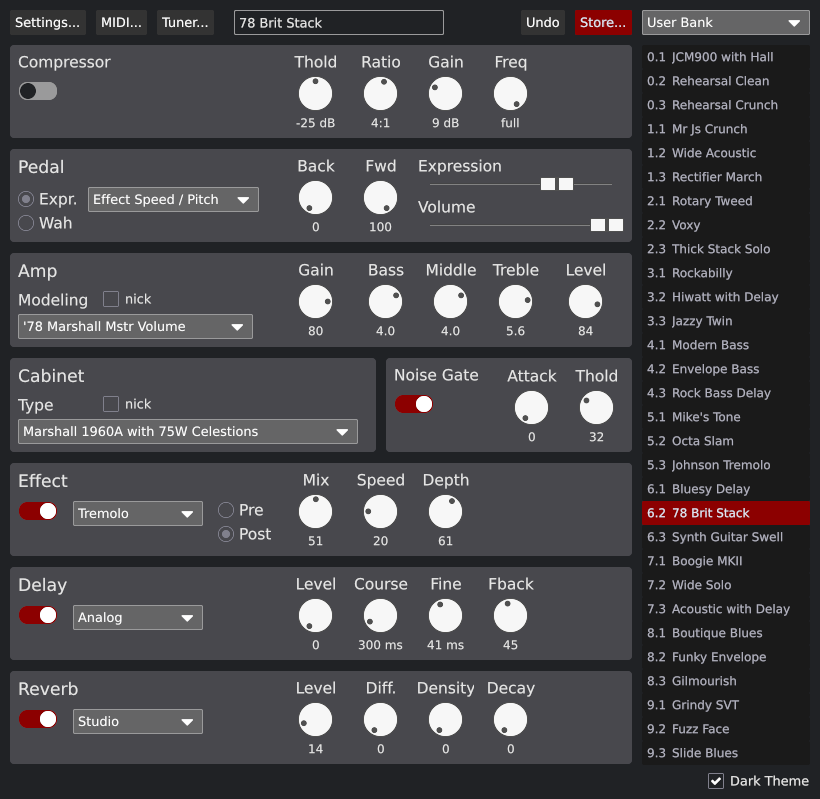

# jstation-controller 

`jstation-controller` is a cross-platform interface to control the J-Station guitar and bass modeling and effect processing system.

Pre-built packages are available for Linux, macOS and Windows from the
[release page](https://github.com/fengalin/jstation-controller/releases).
See the dedicated chapter below if you want to build the application from source.



## Features

- [X] Scan the available MIDI ports for a J-Station device.
- [X] Download device Programs.
- [X] Show the parameters for selected Program.
- [X] Use the UI to update a parameter.
- [X] Reflect device parameters updates on the UI.
- [X] Show the list of Programs.
- [X] Change Program from the UI.
- [X] Rename a Program.
- [X] Store / undo pending modifications.
- [X] Turn tuner on / off.
- [ ] Import a Program bank from a file.
- [ ] Export a Program bank to a file.

## Troubleshooting

### Could not connect to J-Station

There are many reasons for not being able to connect to the J-Station.
This could range from a simple physical connection to conflicts with
other MIDI devices.

#### Check the connection

1. Make sure the MIDI OUT link from the computer is connected to the
   MIDI IN port on the J-Station and vice versa.
2. Make sure the MIDI/J8 switch of the J-Station is switched to the right
   when looking at the back of the J-Station. The switch must be vertically
   aligned with the top mark next to the MIDI IN label.

#### Check that the MIDI interface is detected

##### The main window shows up

The MIDI ports detected should show up in the MIDI Connection picklists.
If the picklists are empty, you probably have an issue with your MIDI interface.
Check if you need to install drivers and if thee are properly installed.

If you can see the MIDI ports in the picklists but the connection fails when
you try to auto-connect:

- Disconnect any other MIDI device
- Follow the J-Station User's Guide and change the MIDI channel (see Section 5 -
Other Functions, p. 29 of the english version).

## Build from Source

Prebuilt packages are available for Linux, macOS and Windows from the
[Release page](https://github.com/fengalin/jstation-controller/releases).

The following chapters are only intended for users who want to build the
application from source.

### Dependencies

This application uses the following crates which require system level libraries:

- [`iced`](https://crates.io/crates/iced).
- [`midir`](https://crates.io/crates/midir).

#### Linux

Minimum dependencies include development libraries for:

- Wayland (`libwayland-client`, `libwayland-dev`, ...) or X11 (`libxkbcommon-dev`, ...)
- alsa (`alsa-lib-devel`, `libasound2-dev`, ...)

#### macOS

If you can test the application on this OS, please open a PR with instructions.

#### Windows

If you can test the application on this OS, please open a PR with instructions.

### Build

You need a stable Rust toolchain for the target host. Get it from [this page](https://www.rust-lang.org/fr/tools/install).
On a Unix-like system, you should be able to install `rustup` from your packet
manager.

Clone the git tree and run the following command in an environment where
`cargo` is available:

```
cargo b --release
```

### Run

After a successful compilation, launch the executable with:

```
target/release/jstation-controller
```

## LICENSE

This crate is licensed under MIT license ([LICENSE-MIT](LICENSE-MIT) or
http://opensource.org/licenses/MIT)
